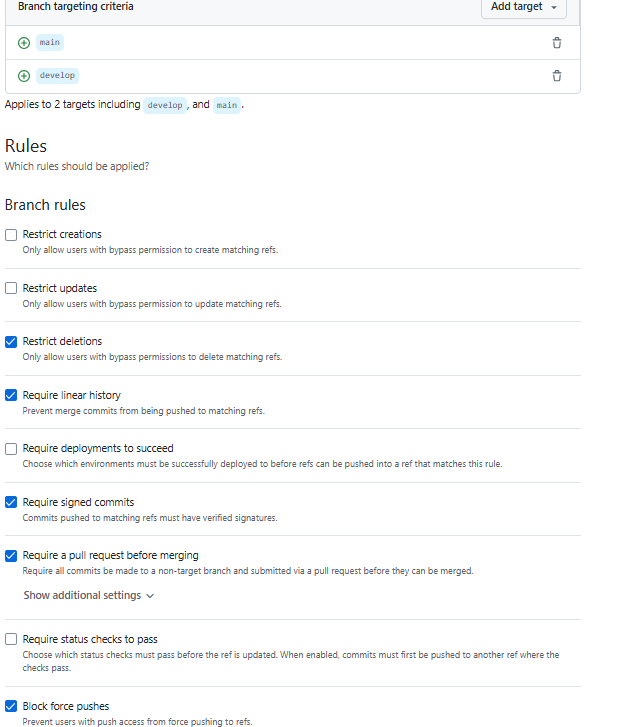

# Gym Management System

A complete fullstack gym management application built with modern web technologies.

## Features

### User Features
- **User Dashboard**: View stats, billing, and recent bookings
- **Class Booking**: Book and cancel fitness classes
- **Subscription Management**: View subscription details and billing
- **Profile Management**: Update personal information

### Admin Features
- **Admin Dashboard**: Overview of gym statistics and revenue
- **User Management**: CRUD operations for users
- **Class Management**: Create, update, and delete fitness classes
- **Booking Management**: View and manage all bookings
- **Subscription Management**: Manage user subscriptions

### Business Logic
- **Capacity Management**: Classes have maximum capacity limits
- **Time Conflict Prevention**: Users cannot book overlapping classes
- **Cancellation Policy**: 2-hour cancellation policy (late cancellations become no-shows)
- **Billing System**: Dynamic pricing with no-show penalties
- **Subscription Types**: Standard (€30), Premium (€50), Student (€20)

## Tech Stack

### Backend
- **Node.js** with Express.js
- **Prisma** ORM with PostgreSQL
- **RESTful API** with proper error handling
- **MVC Architecture** with repositories pattern

### Frontend
- **Vue.js 3** with Composition API
- **Pinia** for state management
- **Vue Router** with navigation guards
- **Responsive CSS** styling

### DevOps
- **Docker** containerization
- **Docker Compose** for orchestration
- **PostgreSQL** database
- **Nginx** for frontend serving

## Quick Start

### Prerequisites
- Docker and Docker Compose
- Git

### Installation

1. **Clone the repository**
   ```bash
   git clone <repository-url>
   cd gym-management-system
   ```

2. **Set up environment variables**
   ```bash
   cp .env.example .env
   ```
   
   Edit `.env` file if needed (default values should work for development).

3. **Start the application**
   ```bash
   docker-compose up --build
   ```

4. **Access the application**
   - Frontend: http://localhost:8080
   - Backend API: http://localhost:3000
   - Database: localhost:5432

### Default Login Credentials

The application comes with seeded test data:

**Admin User:**
- Email: admin@gym.com
- Password: admin123
- Role: ADMIN

**Regular Users:**
- Email: john.doe@email.com
- Email: jane.smith@email.com  
- Email: mike.wilson@email.com
- Password: password123 (for all users)

## Project Structure

```
gym-management-system/
├── backend/
│   ├── src/
│   │   ├── controllers/     # Request handlers
│   │   ├── services/        # Business logic
│   │   ├── repositories/    # Data access layer
│   │   ├── routes/          # API routes
│   │   └── prisma/          # Database schema and client
│   ├── seed/                # Database seeding
│   └── Dockerfile
├── frontend/
│   ├── src/
│   │   ├── views/           # Vue components/pages
│   │   ├── services/        # API communication
│   │   ├── store/           # Pinia stores
│   │   └── router/          # Vue router
│   ├── Dockerfile
│   └── nginx.conf
└── docker-compose.yml
```

## API Endpoints

### Authentication
- `POST /api/auth/login` - User login

### Users
- `GET /api/users` - Get all users
- `GET /api/users/:id` - Get user by ID
- `POST /api/users` - Create user
- `PUT /api/users/:id` - Update user
- `DELETE /api/users/:id` - Delete user

### Classes
- `GET /api/classes` - Get all classes
- `GET /api/classes/:id` - Get class by ID
- `POST /api/classes` - Create class
- `PUT /api/classes/:id` - Update class
- `DELETE /api/classes/:id` - Delete class

### Bookings
- `GET /api/bookings` - Get all bookings
- `GET /api/bookings/user/:userId` - Get user bookings
- `POST /api/bookings` - Create booking
- `PUT /api/bookings/:id/cancel` - Cancel booking
- `DELETE /api/bookings/:id` - Delete booking

### Subscriptions
- `GET /api/subscriptions` - Get all subscriptions
- `GET /api/subscriptions/user/:userId` - Get user subscription
- `POST /api/subscriptions` - Create subscription
- `PUT /api/subscriptions/:id` - Update subscription

### Dashboard
- `GET /api/dashboard/user/:userId` - Get user dashboard
- `GET /api/dashboard/admin` - Get admin dashboard

## Development

### Local Development Setup

1. **Backend Development**
   ```bash
   cd backend
   npm install
   npm run dev
   ```

2. **Frontend Development**
   ```bash
   cd frontend
   npm install
   npm run dev
   ```

3. **Database Setup**
   ```bash
   cd backend
   npx prisma migrate dev
   npm run seed
   ```

### Database Management

- **View Database**: `npx prisma studio`
- **Reset Database**: `npx prisma db reset`
- **Generate Client**: `npx prisma generate`
- **Run Migrations**: `npx prisma migrate deploy`

### Useful Commands

```bash
# Stop all containers
docker-compose down

# View logs
docker-compose logs -f [service-name]

# Rebuild specific service
docker-compose up --build [service-name]

# Access database
docker exec -it gym_db psql -U postgres -d gym_management
```

## Features in Detail

### Subscription System
- **STANDARD**: €30/month, €5 per no-show
- **PREMIUM**: €50/month, €3 per no-show  
- **ETUDIANT**: €20/month, €7 per no-show

### Booking Rules
- Users can only book future classes
- Maximum capacity per class is enforced
- No double-booking at the same time slot
- 2-hour cancellation policy

### Admin Dashboard
- Total users and active subscriptions
- Booking statistics (confirmed, no-show, cancelled)
- Monthly revenue calculations
- User management tools

### User Dashboard
- Personal statistics and activity
- Current subscription details
- Monthly billing with no-show penalties
- Recent booking history

## Contributing

1. Fork the repository
2. Create a feature branch
3. Make your changes
4. Add tests if applicable
5. Submit a pull request

## License

This project is licensed under the MIT License.

## Support

For support or questions, please open an issue in the repository.

# 📌 Git & Commit Guidelines

## ✔ Branches

- **Main branches:** `main`, `develop`  
  - No direct commits allowed  
  - Pull Request (PR) required for changes  
  - CI checks must pass before merge  

- **Feature branches:** `feature/<name>`  
  - Develop features here  
  - Merge into `develop` via PR  

---

## ✔ Commit Convention

Use **Conventional Commits** format:  


### Common types

- `feat`: new feature  
- `fix`: bug fix  
- `chore`: maintenance / dependency updates  
- `docs`: documentation  
- `refactor`: code refactoring  
- `test`: adding or updating tests  
- `style`: formatting / code style  
- `perf`: performance improvements  

### Commit examples
- `feat: add authentication`
- `fix: fix Postgres connection`
- `chore: update NestJS dependencies`

---

## ✔ Active Git Hooks

- **`pre-commit`**: runs lint for front-end and back-end before committing  
- **`commit-msg`**: checks that commit messages follow the convention  

---

## ✔ Pre-Push Hook – Collective Protection

**Objective:** prevent broken code from being pushed to GitHub.

- Runs **before pushing**  
- Blocks the push if the project is unstable  
- Possible checks:
  - Run tests
  - Build front-end and back-end

**Key message:**  
> “Just because it commits doesn’t mean it deserves to be shared.”




## ✔ CI


## SONAR BADGES

[](https://sonarcloud.io/summary/new_code?id=ValerieRas_CloudNativeApplicationCurse)


[](https://sonarcloud.io/summary/new_code?id=ValerieRas_CloudNativeApplicationCurse)


## Schéma Pipeline

```mermaid
flowchart TD
    A[Push / PR] --> B(Lint Front & Back)
    B --> C(Build Front & Back)
    C --> D(Tests Backend)
    D --> E(SonarCloud Analysis)
    E --> F{Quality Gate}
    F -->|Passed| G[Merge PR possible]
    F -->|Failed| H[Block Merge]

